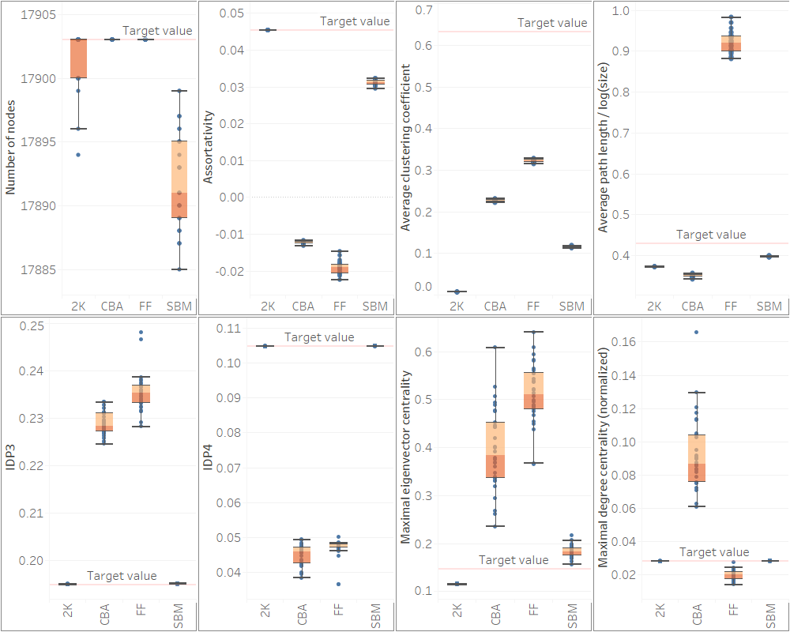

# Structural analysis of real networks and their model-generated counterparts
Supplementary data for the paper: [Nagy, M., & Molontay, R. (2022). Network classification-based structural analysis of real networks and their model-generated counterparts. *Network Science*, 1-24](https://www.cambridge.org/core/journals/network-science/article/abs/network-classificationbased-structural-analysis-of-real-networks-and-their-modelgenerated-counterparts/44C79234EAF40C5F02A340E15CD8F638).
## How to Cite
```
@article{nagy2022network,
  title={Network classification-based structural analysis of real networks and their model-generated counterparts},
  author={Nagy, Marcell and Molontay, Roland},
  journal={Network Science},
  pages={1--24},
  year={2022},
  publisher={Cambridge University Press}
}

```


## Source
The graphs are collected from the following sources: 
* [Network Repository](http://networkrepository.com), 
* [The Colorado Index of Complex Networks (ICON)](http://networkrepository.com), 
* [NeuroData's Graph DataBase](http://openconnecto.me/graph-services/download/), 
* [KONECT - The Koblenz Network Collection](http://konect.uni-koblenz.de/), 
* [Interaction Web Database (IWDB)](https://www.nceas.ucsb.edu/interactionweb/resources.html), 
* [Transportation Networks for Research](https://github.com/bstabler/TransportationNetworks),
* [Centre for Water Systems](http://emps.exeter.ac.uk/engineering/research/cws/resources/benchmarks/)


__The collected networks canbe found in the [networks folder](./networks)__

## Summary of Networks


| Domain | Description | Range of network size | Number of networks |
|-----------------|--------------------------------------------------------------|:---------------------------------------:|:--------------:|
| Brain | Human and animal connectomes | 50-2,995 <br> (avg: 946) | 100 |
| Cheminformatics | Protein-protein (enzyme) interaction networks | 44-125 <br> (avg: 55) | 100 |
| Food | What-eats-what, consumer-resource networks | 19-1,500 <br> (avg: 118) | 100 |
| Infrastructural | Transportation (metro, bus, road, airline) and distribution networks (power and water) | 39-40K <br> (avg: 4,562) | 68 |
| Social | Facebook, Twitter and collaboration networks | 85-34K <br> (avg: 5,183) | 118 |
| Web | Pieces of the World Wide Web | 146-16K <br> (avg: 4,488) | 14 |


## Graph Measurements
The [data folder](./data) contains a spreadsheet that contains the calculated metrics of the 482 real networks. 

The calculated metrics are the following:
- assortativity, 
- average clustering coefficient, 
- average degree, 
- average path length, 
- density, 
- global clustering coefficient, 
- four interval degree probabilities introduced in [this paper](https://ieeexplore.ieee.org/abstract/document/7000748),
- largest eigenvector centrality, 
- maximum degree, 
- maximum edge betweenness centrality,
- maximum vertex betweenness centrality,
- number of edges,
- number of nodes, 
- pseudo diameter

A detailed description of the dataset and the metrics can be found in [Network classification-based structural analysis of real networks and their model-generated counterparts](https://www.cambridge.org/core/journals/network-science/article/abs/network-classificationbased-structural-analysis-of-real-networks-and-their-modelgenerated-counterparts/44C79234EAF40C5F02A340E15CD8F638) and in [*Data-driven Analysis of Complex Networks and their Model-generated Counterparts*](https://arxiv.org/abs/1810.08498)


# Supplementary material


