# Network classification-based structural analysis of real networks and their model-generated counterparts
Supplementary data for the paper: [Nagy, M., & Molontay, R. (2022). Network classification-based structural analysis of real networks and their model-generated counterparts. *Network Science*, 1-24](https://www.cambridge.org/core/journals/network-science/article/abs/network-classificationbased-structural-analysis-of-real-networks-and-their-modelgenerated-counterparts/44C79234EAF40C5F02A340E15CD8F638).
## How to Cite
```
@article{nagy2022network,
  title={Network classification-based structural analysis of real networks and their model-generated counterparts},
  author={Nagy, Marcell and Molontay, Roland},
  journal={Network Science},
  pages={1--24},
  year={2022},
  publisher={Cambridge University Press}
}

```


## Source
The graphs are collected from the following sources: 
* [Network Repository](http://networkrepository.com), 
* [The Colorado Index of Complex Networks (ICON)](http://networkrepository.com), 
* [NeuroData's Graph DataBase](http://openconnecto.me/graph-services/download/), 
* [KONECT - The Koblenz Network Collection](http://konect.uni-koblenz.de/), 
* [Interaction Web Database (IWDB)](https://www.nceas.ucsb.edu/interactionweb/resources.html), 
* [Transportation Networks for Research](https://github.com/bstabler/TransportationNetworks),
* [Centre for Water Systems](http://emps.exeter.ac.uk/engineering/research/cws/resources/benchmarks/)


__The collected networks canbe found in the [networks folder](./networks)__

## Summary of Networks


| Domain | Description | Range of network size | Number of networks |
|-----------------|--------------------------------------------------------------|:---------------------------------------:|:--------------:|
| Brain | Human and animal connectomes | 50-2,995 <br> (avg: 946) | 100 |
| Cheminformatics | Protein-protein (enzyme) interaction networks | 44-125 <br> (avg: 55) | 100 |
| Food | What-eats-what, consumer-resource networks | 19-1,500 <br> (avg: 118) | 100 |
| Infrastructural | Transportation (metro, bus, road, airline) and distribution networks (power and water) | 39-40K <br> (avg: 4,562) | 68 |
| Social | Facebook, Twitter and collaboration networks | 85-34K <br> (avg: 5,183) | 118 |
| Web | Pieces of the World Wide Web | 146-16K <br> (avg: 4,488) | 14 |


## Graph Measurements
The [data folder](./data) contains a spreadsheet that contains the calculated metrics of the 482 real networks. 

The calculated metrics are the following:
- assortativity, 
- average clustering coefficient, 
- average degree, 
- average path length, 
- density, 
- global clustering coefficient, 
- four interval degree probabilities introduced in [this paper](https://ieeexplore.ieee.org/abstract/document/7000748),
- largest eigenvector centrality, 
- maximum degree, 
- maximum edge betweenness centrality,
- maximum vertex betweenness centrality,
- number of edges,
- number of nodes, 
- pseudo diameter

A detailed description of the dataset and the metrics can be found in [Network classification-based structural analysis of real networks and their model-generated counterparts](https://www.cambridge.org/core/journals/network-science/article/abs/network-classificationbased-structural-analysis-of-real-networks-and-their-modelgenerated-counterparts/44C79234EAF40C5F02A340E15CD8F638) and in [*Data-driven Analysis of Complex Networks and their Model-generated Counterparts*](https://arxiv.org/abs/1810.08498)


# Supplementary material


## Analysis of network models 

According to the Random Forest classifier, when the goal is to predict whether the network is real or model-generated, the most distinguishing graph metrics are the normalized average path length, the average clustering coefficient, the maximum eigenvector centrality, and the assortativity. 

The following figures show  the structural properties of the real networks that the network models cannot capture. In other words, the distribution of the most distinguishing graph metrics of the real networks and the model-generated graphs.

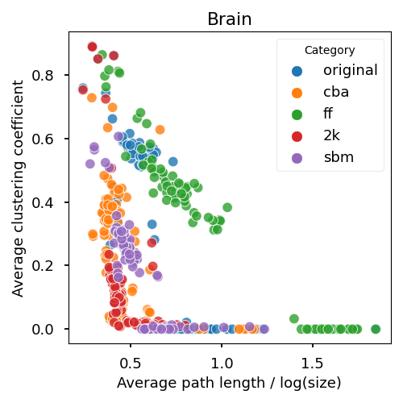
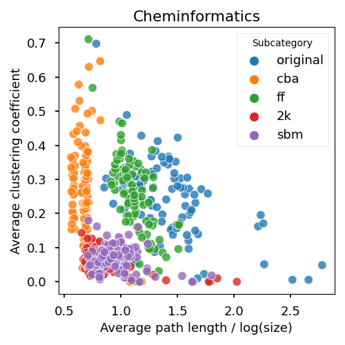
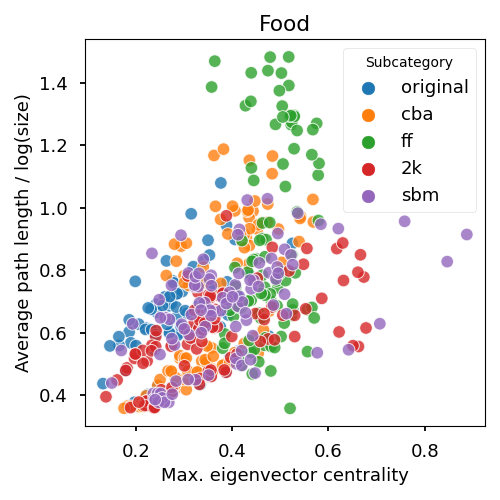
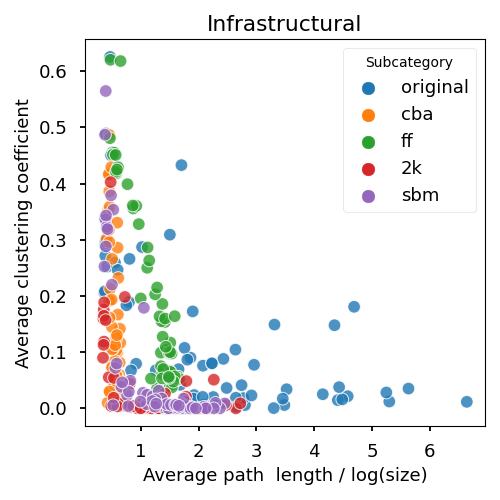
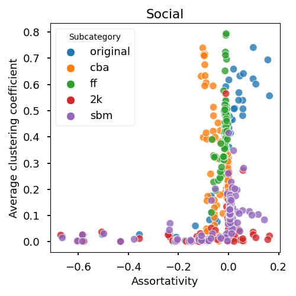
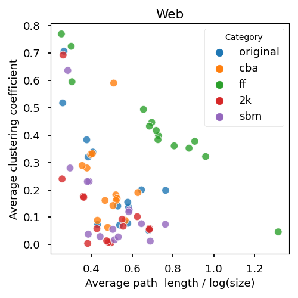


## Stability of the networks 

Since the network models generate random graphs, the question naturally comes up: How robust are the graph metrics of the fitted models with fixed parameters?
We have analyzed the sensitivity of the models on six different-sized graphs from different domains, the chosen networks are detailed in the table below.  For each of these six real networks, we fitted each network model and then generated 30 graph instances with each model using the previously fitted parameter settings. For the sensitivity analysis, we studied the distribution of the graph measurements of the graph instances.


| Domain           | Name                                 | Size   | Number of edges |
|------------------|--------------------------------------|--------|-----------------|
| Social           | ca-AstroPh (Leskovec et al., 2007)   | 17,903 | 196,972         |
| Web              | Darkweb (Griffith et al., 2017)      | 7,178  | 24,879          |
| Brain            | Jung2015 (Kiar, 2016)                | 2,989  | 31,548          |
| Infrastructure   | ABN (Chatterjee et al., 2016)        | 1,103  | 2,150           |
| Food             | Srep (Dunne et al., 2016)            | 235    | 1,743           |
| Cheminformatics  | Enzymes-g292 (Canning et al., 2018)  | 60     | 100             |

## Social network (ca-AstroPh)
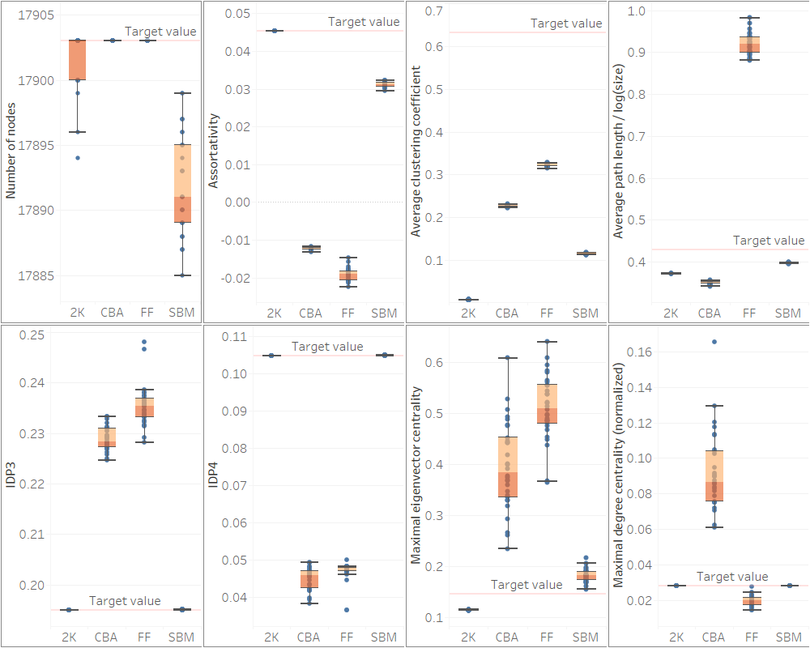

## Web network (Darkweb)
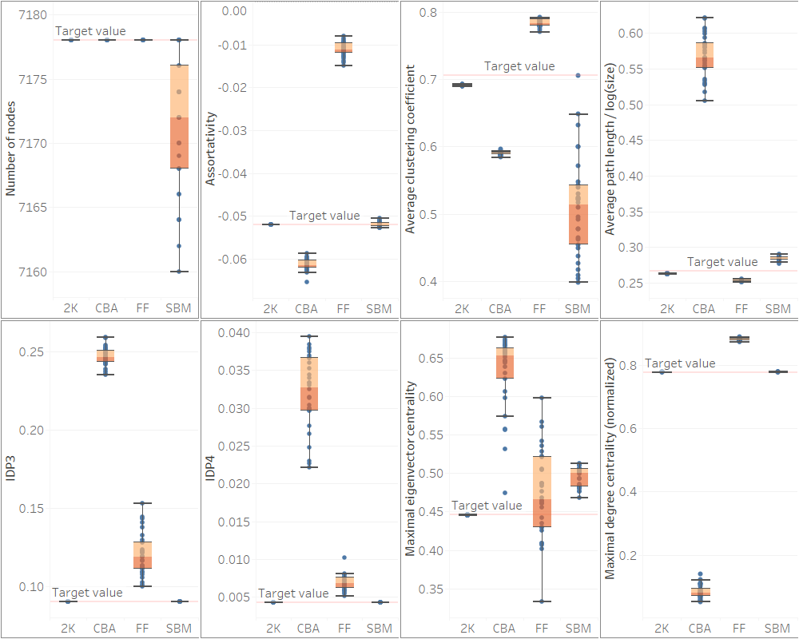

## Brain network (Jung2015)
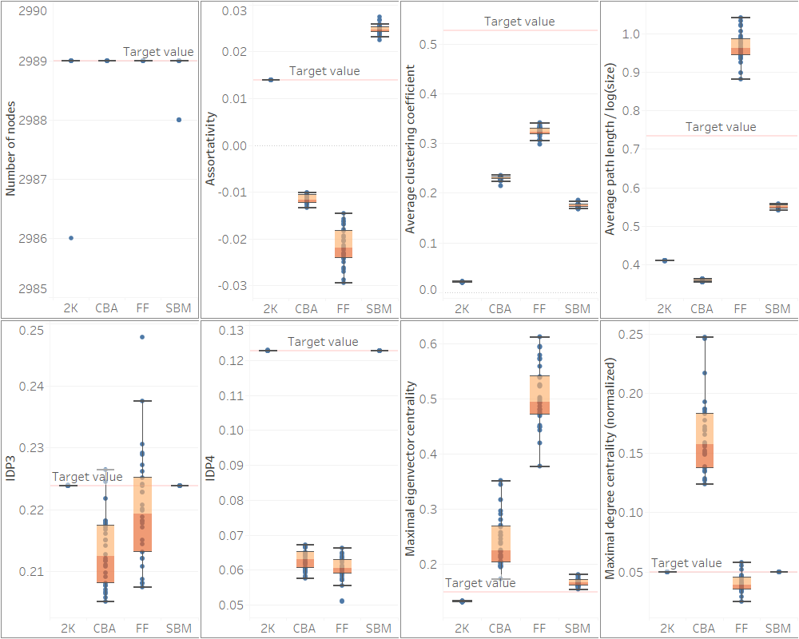

## Infrastructure network (ABN)
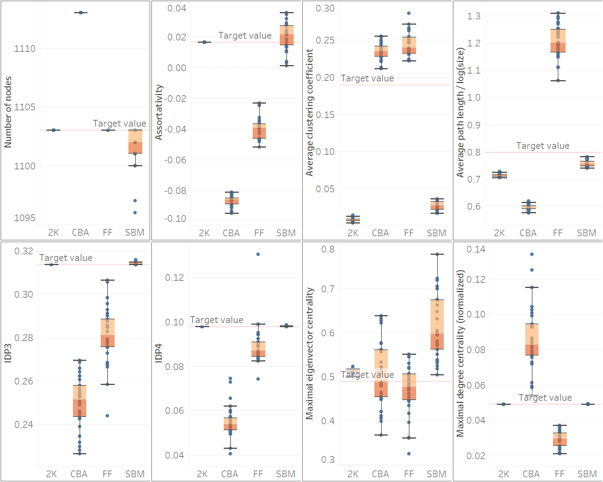

## Food network (Srep)
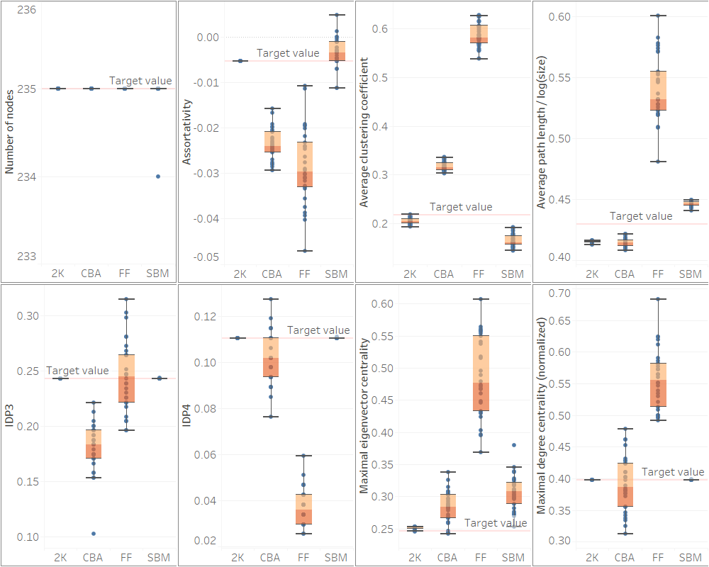

## Cheminformatics network (Enzymes-g292)
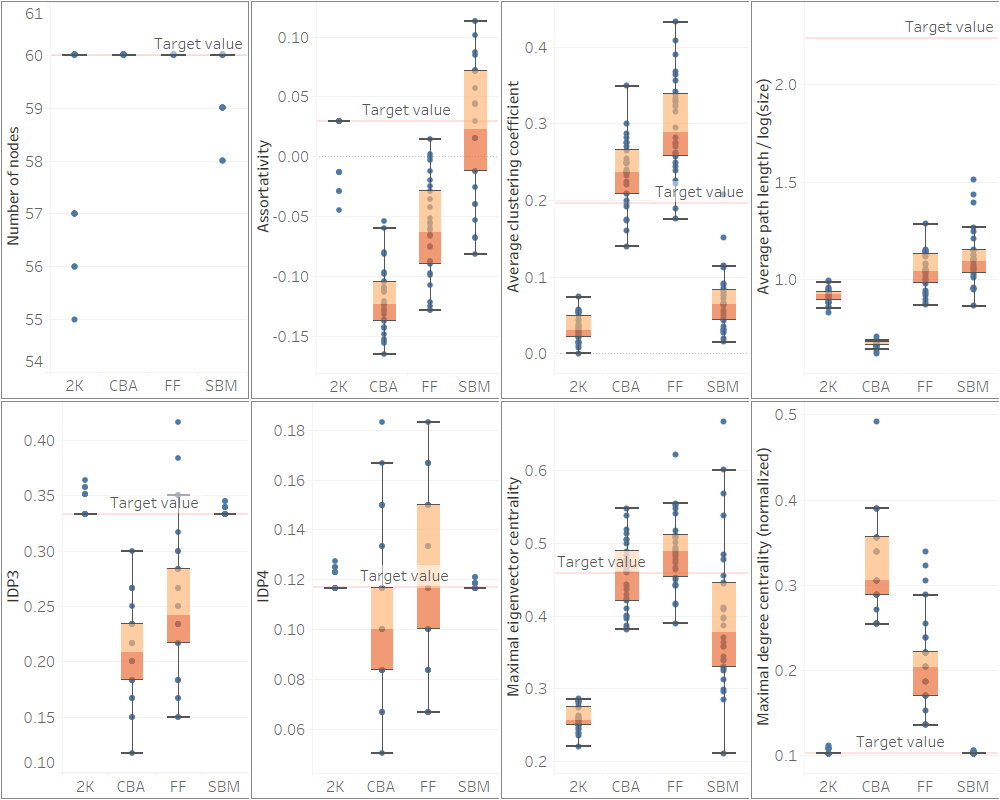

